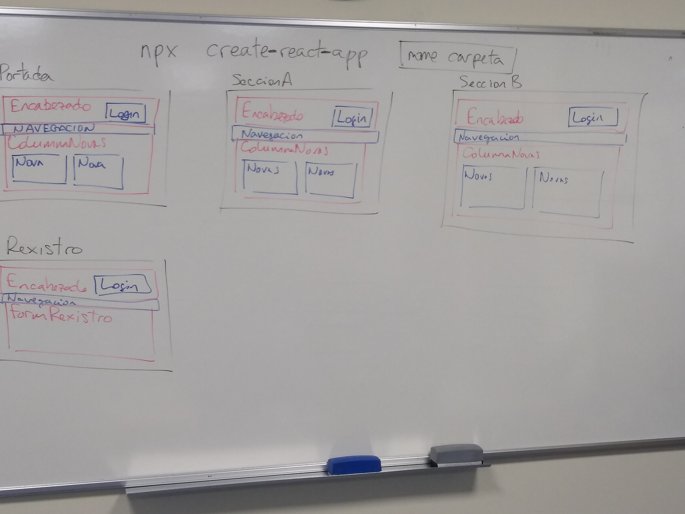

# Getting Started with Create React App

This project was bootstrapped with [Create React App](https://github.com/facebook/create-react-app).

## Available Scripts

In the project directory, you can run:

### `npm start`

Runs the app in the development mode.\
Open [http://localhost:3000](http://localhost:3000) to view it in your browser.

The page will reload when you make changes.\
You may also see any lint errors in the console.

### `npm test`

Launches the test runner in the interactive watch mode.\
See the section about [running tests](https://facebook.github.io/create-react-app/docs/running-tests) for more information.

### `npm run build`

Builds the app for production to the `build` folder.\
It correctly bundles React in production mode and optimizes the build for the best performance.

The build is minified and the filenames include the hashes.\
Your app is ready to be deployed!

See the section about [deployment](https://facebook.github.io/create-react-app/docs/deployment) for more information.

### `npm run eject`

**Note: this is a one-way operation. Once you `eject`, you can't go back!**

If you aren't satisfied with the build tool and configuration choices, you can `eject` at any time. This command will remove the single build dependency from your project.

Instead, it will copy all the configuration files and the transitive dependencies (webpack, Babel, ESLint, etc) right into your project so you have full control over them. All of the commands except `eject` will still work, but they will point to the copied scripts so you can tweak them. At this point you're on your own.

You don't have to ever use `eject`. The curated feature set is suitable for small and middle deployments, and you shouldn't feel obligated to use this feature. However we understand that this tool wouldn't be useful if you couldn't customize it when you are ready for it.

## Learn More

You can learn more in the [Create React App documentation](https://facebook.github.io/create-react-app/docs/getting-started).

To learn React, check out the [React documentation](https://reactjs.org/).




# Introducción a React

## Inicio de un proyecto de react

### Creando un proyecto desde cero
```shell
$ npx create-react-app nombre-de-la-carpeta-del-nuevo-proyecto
```
### Clonando un repositorio Git de un proyecto ya existente
```shell
$ git clone url-clonado-repo-github
$ cd carpeta-repositorio
$ npm install
```

## Puesta en marcha del proyecto
```shell
$ npm start
```
## Componentes
### Declaración
```jsx
function NomeDelComponente() {
    // Aquí o teu JavaScript
    return (
        <>
        <!-- Aquí o teu HTML>
        </>
    )
}
```
Para ver como incluir CSS, consulta [Módulos CSS](#módulo-css)
### Invocando/llamando/usando el componente
```jsx
import NomeDelComponente from "../ruta/al/fichero/del/componente"
function EsteComponenteUsaAlAnterior(){
    return (
        <>
        <NombreDelComponente/>
        </>
    )
}
export default EsteComponenteUsaAlAnterior
```
### Expresiones de JavaScript en el HTML de un componente
```jsx
function NomeDelComponente() {
    let titulo = "Este es el título."
    return (
        <>
        <h1>{titulo}</h1>
        </>
    )
}
```
### Pasando propiedades (props) a un componente
Este es el componente que recibe las propiedades
```jsx
function NomeDelComponente(props) {
    return (
        <>
        <h1>{props.titulo}</h1>
        </>
    )
}
```
Esta es la forma de proporcionarle las propiedades
```jsx
import NomeDelComponente from "../ruta/al/fichero/del/componente"
function EsteComponenteUsaAlAnterior(){
    return (
        <>
        <NombreDelComponente titulo="Este es el titulo."/>
        </>
    )
}
export default EsteComponenteUsaAlAnterior
```
## Incluyendo archivos
### Imágenes
```jsx
import nombreParaImagen from "ruta/fichero/imagen.png"
function NombreComponente(){
    return (
        
    )
}
export default NombreComponente
```
### CSS
Empregar sólo para el CSS global, que afectará a todo el HTML de la aplicación independientemente del componente del que proceda.
```jsx
// ./NombreComponente.jsx
import "./NombreComponente.css"
function NombreComponente(){
    return (
        <h1>Mi aplicación</h1>
    )
}
export default NombreComponente
```
```css
/* ./NombreComponente.css */
h1 {
    text-align: center;
}
```
### Módulo CSS
Emplear de forma generalizada para proporcionar CSS exclusivo a un componente, sin riesgo de que el HTML de otros componentes se vea afectado.
```jsx
// ./NombreComponente.jsx
import styles from "./NombreComponente.module.css"
function NombreComponente(){
    return (
        <h1 className={styles.nombreClaseCSS}>Mi aplicación</h1>
    )
}
export default NombreComponente
```
```css
/* ./NombreComponente.module.css */
.nombreClaseCSS {
    text-align: center;
}
```
## Hooks

### useState
Es el hook más frecuente en los componentes. Resulta dificil hacer un componente de React que no emplee `useState`.

Tienen dos finalidades:
- Permiten que los componentes de React "recuerden" valores.
- Permiten que React sea notificado de cambios en estos valores para que puede actualizar la información relacionada que se muestra en la pantalla.

Está compuesto de una constante en la que se almacena el estado que pretendemos que el componente recuerde y una función que nos permite actualizar el valor del estado.

Ejemplo de contador:

```jsx
// Impotamos useState para poder usarlo
import { useState } from "react";
function Contador () {
    // Creamos el estado y asignamos el valor inicial con useState
    const [ contador, setContador] = useState(0)
    function manexadorDoClick () {
        // Usamos el setter cuando queremos cambiar el valor del estado
        setContador(contador+1)
    }
    return (
        <>
        <!-- Usamos o estado para acceder ó valor -->
        <p>Total: {contador}</p>
        <button onClick={manexadorDoClick}>
            Contar
        </button>
        </>
    )
}
export default Contador
```
Ejemplo de useState para controlar elementos de formulario:
```jsx
import { useState } from "react"
function Registro() {
    let [ nombre, setNombre ] = useState("")
    /**
    El manejador se encarga de acceder al contenido introducido en el input
    y de actualizar con el el valor del estado.
    */
    function manejadorDeEntradasEnNombre(evento) {
        const nuevoValor = evento.target.value
        setNome(nuevoValor);
    }
    return (
        <>
        <label>
            Nombre:
            <!--
                Actualizamos el valor del input asignandole el 
                valor almacenado en el estado.
                Cuando se introduce un nuevo valor en el input llamamos
                al manejador para actualizar el estado.
            -->
            <input type="text" name="nombre" value={nombre} onInput={manejadorDeEntradasEnNombre}/>
            <p>Este es el contenido en maiusculas: {nombre.toUpperCase()}</p>
        </label>
        </>
    )
}
export default Rexistro
```